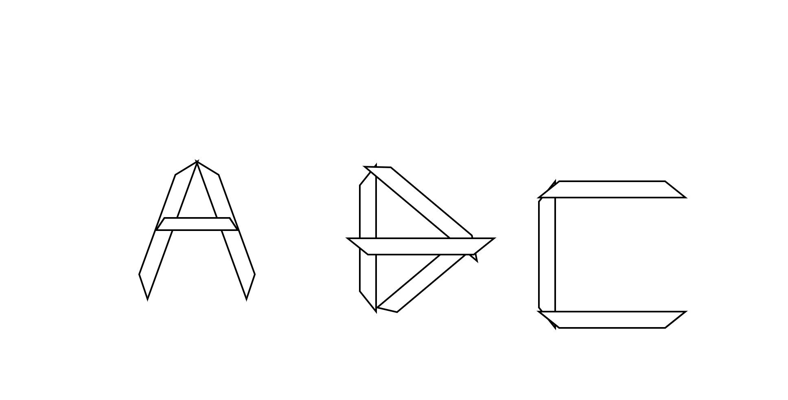
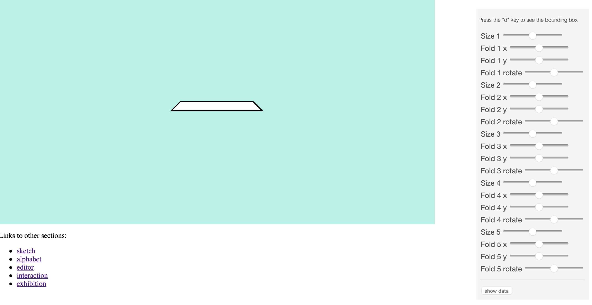
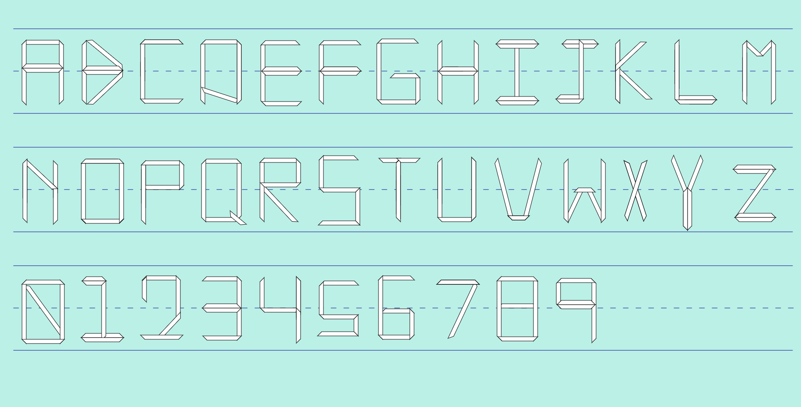
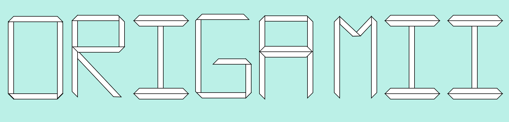

## MDDN 242 2024 Assignment 2

Isaiah Warbri

My decided font name is Origamii (originally Origami, but since the exhibition section required 8 letter words I decide to stylize it as Origamii)

My idea for this project started with a want for something simple and geometric in the hopes I could keep my number of parameters low. That's when I decided to go for the concept of origami or at least folded paper

I started with my sketch 

My initial parameters were defined into seperate categories based on the shape (i.e shape 1 to 4). Each of these categories had the parameters offsetx, offsety, rotation, topwidth, bottomwidth and height. I already saw initial issues with this such as the widths as it didn't allow me to change the length of my trapezoids but only the overall shape. This would be helpful in some instances but I preferred having the length change in order to reduce my parameters.

This was fairly easy to carry over to my drawletter file. I cleaned up the code and increase the number of shapes to 5. I reduced the number of parameters needed for each shape size, offsetx, offsety and rotation. By adding a number to the end of each parameters, I am able to define with shape the parameters attach itself to. This leaves with me with this list of parameters

    "size1": 
    "offsetx": 
    "offsety": 
    "rotation1": 
    "size2": 
    "offsetx2": 
    "offsety2": 
    "rotation2": 
    "size3": 
    "offsetx3": 
    "offsety3": 
    "rotation3": 
    "size4":
    "offsetx4": 
    "offsety4": 
    "rotation4": 
    "size5": 
    "offsetx5": 
    "offsety5": 
    "rotation5": 

I placed these into my editor. I have 20 parameters so it was neccesary for me to move the slider container in order for me to still switch between tabs

From here I created my alphabet, adjust the sliders as neccesary and copying the data unti I had all the letters and numbers I required

Once my alphabet was created I updated the neccesary interpolation values and found an issue where it wasn't working if I set the boundaries from 0,100. Instead I had to set it to 0,91 which I found through trial and error. Still not sure why this was the case.

I then did my exhibition page and updated it with my font name 

Finally, I changed the page colour to white and added a little paper plane at the top for aesthetics :)

1[exhibitionfinal](exhibitionfinal.png)